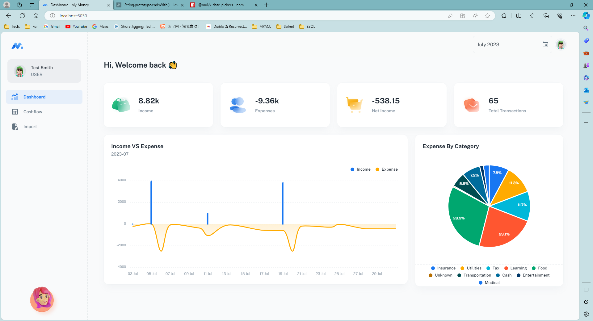
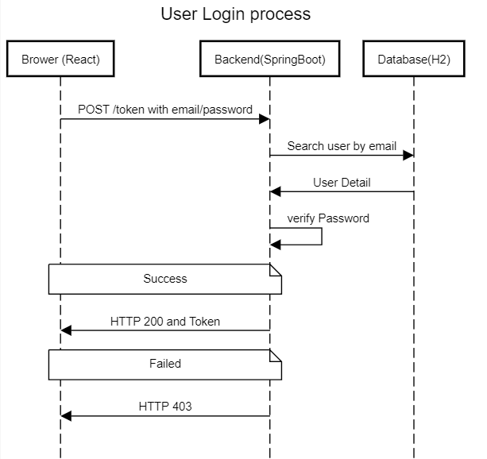
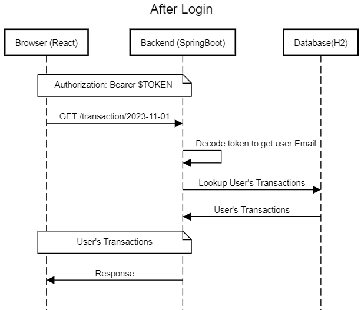

# My Money
A single page web application to report user's income and expenses based on bank card transactions exported from online banking systems(currently support ANZ csv format)\
It is currently hosted at [My Money](https://sohpie0217nzmymoneyapi.azurewebsites.net/)
# Technology Stack
## React
A website template from MUI is obtained to provide styles and main web frames.
Front end interact with backend application via Rest APIs.

## Backend
A Java Spring Boot application is created to provide Rest API services. following Spring Boot component is used:
- Starter-Web 
- Starter-Data-JPA
- Starter-Security

## DataBase
Embedded H2 database (memory) is used to store imported transaction data. As JPA is used for persistence, switch to a formal database can be achieved easily.\
Persisting H2 data into disk seems not necessary, as the application will be run in container, writing to container internal storage is meaningless.\
As the application is only for demo purpose, not persisting user's bank transaction data reduce the chance of data leaking.

## Security
As the application is intended to be hosted in public cloud, to secure communication between React and Backend, Json Web Token is used for api calls.
User login Sequence:

Get user transactions from browser after login

Expect requests used for login (to obtain token) and signup

## Expense Tagging
The application implemented a rule based tagging mechanism, which tags transactions based on a few existing dictionary files.
It may not able to cover new user's transaction data. \
Common approach could be adding a few new pages to maintain a category table, and allow user to select uncategorized transactions. But this is not an ideal solution, as it would be too much work thus impacting user experience.\
An ideal  solution would be introducing some machine learning mechanism and learn from existing data and do a pre-categorize, and let user review/correct the category. System will be getting smarter and smarter, and eventually able to categorize transactions without user interference.\
I'm actively working on introducing xgboost for this part. 

